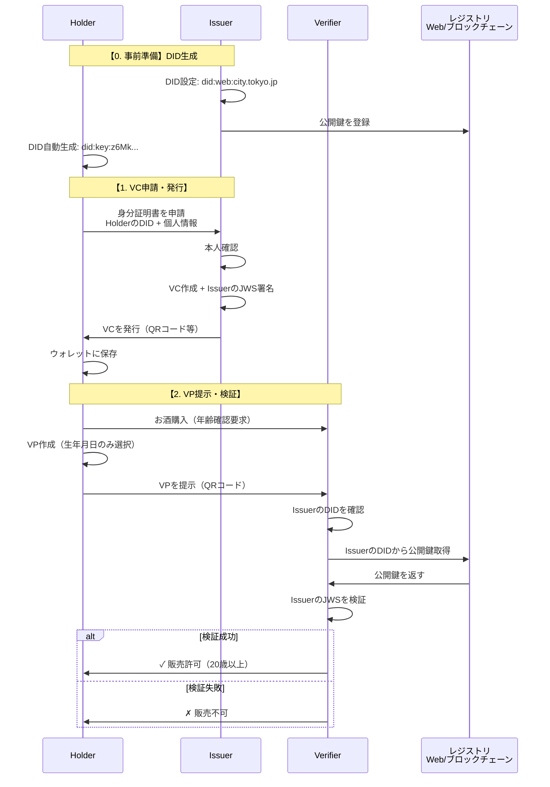

<div align="center">

# DID / VC

**Decentralized Identity & Verifiable Credentials**

分散型アイデンティティと検証可能な証明書の基礎学習から実装まで

[](https://www.w3.org/TR/vc-data-model/)
[](LICENSE)
[](https://shumatsumonobu.github.io/did-vc/)

[概要](#概要) · [全体像](#全体像) · [用語と概念](#用語と概念) · [技術詳細](#技術詳細) · [デモ](#デモ) · [参考資料](#参考資料)

</div>


## 概要

DID（分散型識別子）とVC（検証可能な証明書）をブラウザだけで動かす学習用プロジェクト。W3C標準に準拠し、サーバーレスで動作する。

> **→ [デモサイトで体験する](https://shumatsumonobu.github.io/did-vc/)**

### プロジェクト構成

```
/
├── README.md
├── CHANGELOG.md
├── examples/
│   └── basic/              # デモ実装
│       ├── src/            # ソースコード
│       │   ├── index.html
│       │   ├── holder/     # Holder画面（VC管理・VP提示）
│       │   ├── verifier/   # Verifier画面（QRスキャン・認証）
│       │   ├── js/lib/     # 共通ライブラリ
│       │   └── css/
│       ├── dist/           # ビルド済み（本番用）
│       └── vite.config.js
└── docs/                   # GitHub Pages公開用
```

## 全体像

### システムフロー



### 登場人物

| 名称 | 役割 | 具体例 | DID |
|:-----|:-----|:-------|:---:|
| **Holder** | 証明書を保有する個人 | 田中太郎（一般市民） | 必須 |
| **Issuer** | 証明書を発行する機関 | 市役所、大学、病院 | 必須 |
| **Verifier** | 証明書を検証する側 | コンビニ、銀行、企業 | 不要 |

| 要素 | 説明 | 例 |
|:-----|:-----|:---|
| **DID** | 分散型識別子 | `did:web:city.tokyo.jp` |
| **VC** | デジタル証明書 | 身分証明書、卒業証明書 |
| **VP** | 提示用データ（VCから必要部分を抽出） | 生年月日のみ提示 |
| **Wallet** | VCの保管場所 | スマホアプリ、ブラウザ |

## 用語と概念

### DID — Decentralized Identifier

デジタル世界の固有ID。中央管理者なしに、誰でも生成できる識別子。

**誰に必要か**
- **Holder** — 必須。VCの対象として記載される
- **Issuer** — 必須。VCの発行者として署名する
- **Verifier** — 基本不要。高度な用途では推奨

**主要メソッド**

| メソッド | 解決方法 | 特徴 |
|:---------|:---------|:-----|
| `did:web:` | Webサーバー（HTTPS） | ドメインベース、導入しやすい |
| `did:key:` | 公開鍵を直接エンコード | レジストリ不要、最もシンプル |
| `did:ion:` | Bitcoinブロックチェーン | 高い永続性 |
| `did:ethr:` | Ethereumブロックチェーン | スマートコントラクト連携 |

### VC — Verifiable Credential

デジタル版の証明書。紙の証明書と同じ構造を持ち、電子署名で真正性を保証する。

```jsonc
{
  "@context": ["https://www.w3.org/2018/credentials/v1"],
  "type": ["VerifiableCredential"],
  "issuer": "did:web:city.tokyo.jp",        // 発行者
  "credentialSubject": {
    "id": "did:key:z6Mk...",                // 対象者
    "name": "田中太郎",
    "birthDate": "2000-01-01"
  },
  "proof": {
    "jws": "eyJhbGci..."                    // デジタル署名
  }
}
```

### VP — Verifiable Presentation

必要な情報だけを選んで提示する仕組み（選択的開示）。

```
例：お酒を買う時

  VC に含まれる情報    VP で提示する情報
  ┌───────────────┐    ┌───────────────┐
  │ 氏名          │    │               │
  │ 生年月日  ──────────→ 生年月日      │
  │ 住所          │    │               │
  └───────────────┘    └───────────────┘
       全情報              必要最小限
```

住所や氏名は見せない。プライバシーを保護しつつ、必要な証明だけを行う。

### JWS — JSON Web Signature

デジタル印鑑。証明書が本物であることを保証する。

```
紙の卒業証書      = 内容 + 学長の印鑑
デジタル証明書(VC) = 内容 + JWS（電子印鑑）
```

**JWSが保証すること**
- **改ざん防止** — 1文字でも変更すると検証失敗
- **なりすまし防止** — 秘密鍵がないと作成不可
- **発行者証明** — 確実にIssuerが発行したことを証明

**署名と検証の流れ**

```
発行時                          検証時
┌─────────────────────┐        ┌─────────────────────┐
│ 1. 証明書の内容を作成 │        │ 1. 証明書を受け取る   │
│ 2. 秘密鍵で署名      │        │ 2. 公開鍵を取得       │
│ 3. JWSを証明書に付与  │        │ 3. 署名の真正性を確認  │
└─────────────────────┘        │ 4. 合致 → 本物       │
                               │    不一致 → 偽物      │
                               └─────────────────────┘
```

## 技術詳細

### 技術スタック

| カテゴリ | 技術 |
|:---------|:-----|
| フロントエンド | HTML5 / CSS3 / JavaScript (ES6+) |
| UIフレームワーク | Bootstrap 5 |
| ビルドツール | Vite |
| QRコード生成 | qrcode-generator |
| QRコード読み取り | html5-qrcode |

### 実稼働との違い

このデモは学習用に簡略化している。実稼働環境との主な差異は以下の通り。

| コンポーネント | 実稼働 | デモ実装 |
|:--------------|:-------|:---------|
| DID解決 | 分散台帳（Ethereum, Hyperledger等） | LocalStorage |
| 暗号署名 | EdDSA / ECDSA / RSA | 疑似署名（文字列） |
| 鍵管理 | HSM / 暗号ウォレット | ランダム文字列 |
| データ正規化 | JSON-LD Canonicalization | 簡易JSON |
| 相互運用性 | W3C標準完全準拠 | 構造のみ準拠 |

### ウォレット実装

**デモ用（シンプル）**
```javascript
// ブラウザのLocalStorage
localStorage.setItem('vc_wallet', JSON.stringify(credentials));
```

**実用環境**
- PWA + IndexedDB（暗号化保存）
- スマホアプリ（iOS Keychain / Android Keystore）
- ブラウザ拡張機能

### 実装上の課題

| 課題 | 問題 | 解決策 |
|:-----|:-----|:-------|
| QRコードのサイズ制限 | VCが大きすぎてQRに入らない | URLを埋め込み、VCは別途取得 |
| デバイス間データ共有 | LocalStorageは同一ブラウザのみ | 簡易バックエンドまたはP2P通信 |

## デモ

**[→ デモサイトで体験する](https://shumatsumonobu.github.io/did-vc/)**

- VC発行・保管・検証の基本フロー
- QRコードによる提示
- 選択的開示の体験
- スマートフォンとPCでの実デバイス間認証

開発者モード: URLに `?dev=1` を付与するとテスト用ボタンが表示される

## 開発

### セットアップ

```bash
cd examples/basic
npm install
npm run dev        # → http://localhost:5173
```

### スクリプト

| コマンド | 内容 |
|:---------|:-----|
| `npm run dev` | 開発サーバー起動（ホットリロード有効） |
| `npm run build` | プロダクションビルド（`dist/` に出力） |
| `npm run preview` | ビルド結果のプレビュー |
| `npm run deploy:docs` | ビルド + GitHub Pages用ファイル準備 |

### GitHub Pages デプロイ

```bash
cd examples/basic
npm run deploy:docs
git add ../../docs/
git commit -m "docs更新"
git push origin main
```

Repository Settings → Pages → Source: `main` branch, `/docs` folder

## 参考資料

### 公式仕様
- [W3C Verifiable Credentials Data Model](https://www.w3.org/TR/vc-data-model/)
- [W3C Decentralized Identifiers (DIDs)](https://www.w3.org/TR/did-core/)
- [DID Method Registry](https://www.w3.org/TR/did-spec-registries/)

### 関連プロジェクト
- [Microsoft ION](https://github.com/decentralized-identity/ion) — Bitcoinベースの分散型ID
- [Hyperledger Indy](https://www.hyperledger.org/use/hyperledger-indy) — エンタープライズ向けSSI基盤
- [Ethereum DID Registry](https://github.com/uport-project/ethr-did-registry) — EthereumベースのDIDレジストリ

<div align="center">

**shumatsumonobu**

[GitHub](https://github.com/shumatsumonobu) · [X](https://x.com/shumatsumonobu) · [Facebook](https://www.facebook.com/takuya.motoshima.7)

MIT License

</div>
