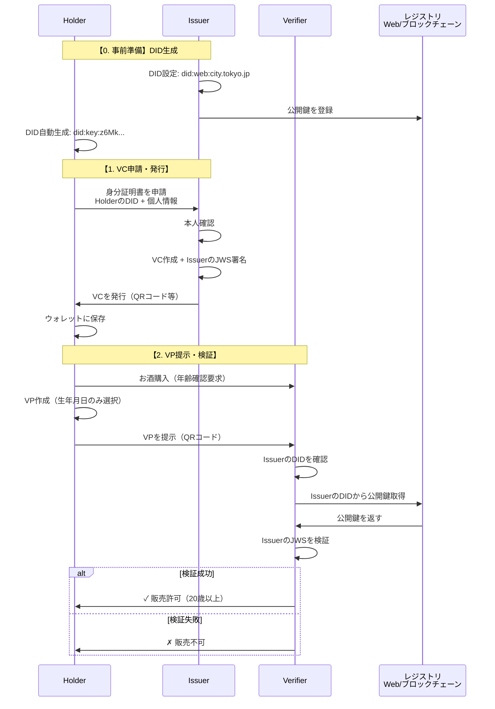

# DID/VC 学習・実装ガイド

分散型アイデンティティ（DID）と検証可能な証明書（VC）の基礎学習から実装まで

## 目次

- [全体像を理解する](#全体像を理解する)
- [用語と概念](#用語と概念)
- [技術詳細](#技術詳細)
- [デモ](#デモ)
- [参考資料](#参考資料)

## 全体像を理解する

### システム全体のフロー



### 登場人物と要素

| 名称 | 役割 | 具体例 | DID必要性 |
|------|------|--------|-----------|
| **Holder** | 証明書を保有する個人 | 田中太郎（一般市民） | 必須 |
| **Issuer** | 証明書を発行する機関 | 市役所、大学、病院 | 必須 |
| **Verifier** | 証明書を検証する側 | コンビニ、銀行、企業 | 不要 |
| **DID** | 識別子 | did:web:city.tokyo.jp | - |
| **VC** | デジタル証明書 | 身分証明書、卒業証明書 | - |
| **VP** | 提示用データ | VCから必要な部分だけ抽出 | - |
| **Wallet** | VCの保管場所 | スマホアプリ、ブラウザ | - |

## 用語と概念

### DID（Decentralized Identifier）
**分散型識別子** - デジタル世界での固有ID

- **必要性**：
  - **Holder**: 必須（VCの対象として記載）
  - **Issuer**: 必須（VCの発行者として署名）
  - **Verifier**: 基本不要、高度な用途では推奨
- **公開鍵の解決方法**：DIDメソッドによって異なる
  - Webサーバー（did:web）
  - ブロックチェーン（did:ethr、did:ion）
  - 鍵自体に埋め込み（did:key）
- **主要な種類**：
  - `did:web:` - Webドメインベース（HTTPSで解決）
  - `did:key:` - 公開鍵を直接エンコード
  - `did:ion:` - Bitcoinベースのレジストリ
  - `did:ethr:` - Ethereumブロックチェーン

### VC（Verifiable Credential）
**検証可能な証明書** - デジタル版の証明書

```json
{
  "@context": ["https://www.w3.org/2018/credentials/v1"],
  "type": ["VerifiableCredential"],
  "issuer": "did:web:city.tokyo.jp",        // 誰が発行したか
  "credentialSubject": {
    "id": "did:key:z6Mk...",                // 誰に対してか
    "name": "田中太郎",
    "birthDate": "2000-01-01"
  },
  "proof": {
    "jws": "eyJhbGci..."                    // デジタル署名
  }
}
```

### VP（Verifiable Presentation）
**検証可能な提示** - 必要な情報だけを選んで提示

例：お酒を買う時
- VCには「氏名、生年月日、住所」が含まれる
- VPでは「生年月日」だけを提示（選択的開示）
- 住所は見せない（プライバシー保護）

### JWS（JSON Web Signature）
**デジタル印鑑** - 証明書が本物であることを保証

現実世界の例え：
```
紙の卒業証書 = 内容 + 学長の印鑑
デジタル証明書(VC) = 内容 + JWS（電子印鑑）
```

JWSがあることで：
- **改ざん防止**：1文字でも変更すると検証失敗
- **なりすまし防止**：秘密鍵がないと作れない
- **発行者証明**：確実にIssuerが発行したと証明

#### JWSの仕組み（超簡単版）

```
【発行時】
1. 大学が証明書の内容を作る
2. 大学の「秘密の印鑑」（秘密鍵）で署名
3. 署名（JWS）を証明書に付ける

【検証時】
1. 検証者が証明書を受け取る
2. 大学の「公開されている印鑑の形」（公開鍵）を取得
3. 署名が本物か確認
4. 合致すれば本物、しなければ偽物
```

## 技術詳細

### ウォレットの実装

**デモ用（シンプル）**
```javascript
// ブラウザのLocalStorage
localStorage.setItem('vc_wallet', JSON.stringify(credentials));
```

**実用環境**
- PWA + IndexedDB（暗号化保存）
- スマホアプリ（iOS Keychain/Android Keystore）
- ブラウザ拡張機能

### 実装における課題と解決策

**QRコードのサイズ制限**
- 問題：VCが大きすぎてQRコードに入らない
- 解決：URLを埋め込み、VCは別途取得

**異なるデバイス間でのデータ共有**
- 問題：LocalStorageは同一ブラウザのみ
- 解決：簡易的なバックエンドまたはP2P通信

## デモ

### 基本デモ
DID/VCの基本的な動作を理解するためのシンプルなデモ

**[デモサイトで体験する](https://takuya-motoshima.github.io/did-vc-dist/)**

- VC発行・保管・検証の基本フロー
- QRコードによる提示
- 選択的開示の体験
- スマートフォンとPCを使った実デバイス間認証

詳細は各デモディレクトリのREADMEを参照

## 参考資料

### デモサイト
**[インタラクティブデモで体験する](https://takuya-motoshima.github.io/did-vc-dist/)**

### 公式仕様
- [W3C Verifiable Credentials](https://www.w3.org/TR/vc-data-model/)
- [W3C Decentralized Identifiers](https://www.w3.org/TR/did-core/)
- [DID Method Registry](https://www.w3.org/TR/did-spec-registries/)

### 実装例
- [Microsoft ION](https://github.com/decentralized-identity/ion)
- [Hyperledger Indy](https://www.hyperledger.org/use/hyperledger-indy)
- [Ethereum DID Registry](https://github.com/uport-project/ethr-did-registry)

## 作成者

**Takuya Motoshima**

* [github/takuya-motoshima](https://github.com/takuya-motoshima)
* [x/takuya_motech](https://x.com/takuya_motech)
* [facebook/takuya.motoshima.7](https://www.facebook.com/takuya.motoshima.7)

## ライセンス

[MIT](LICENSE)